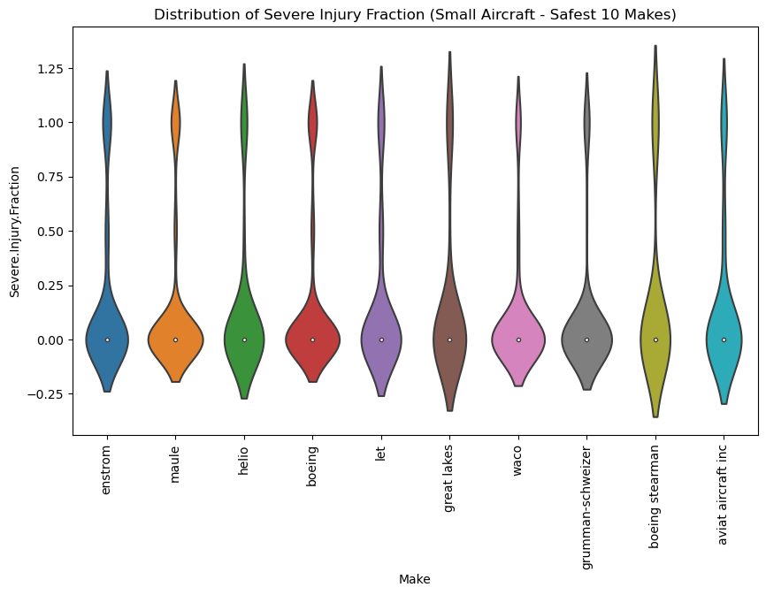
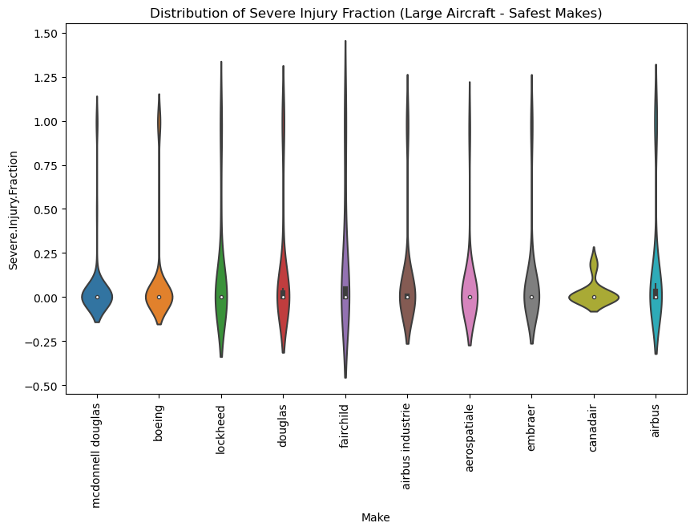
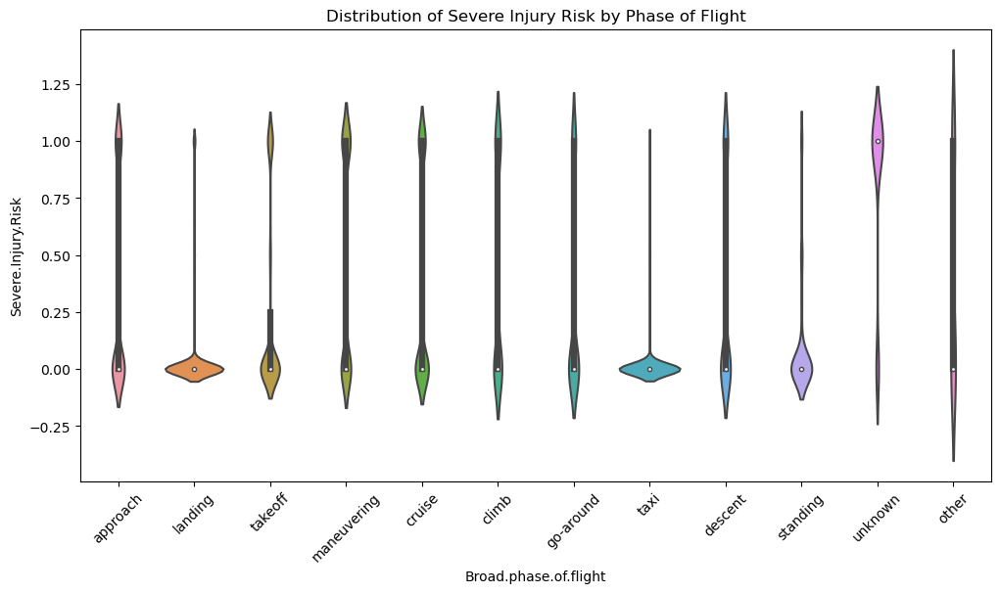
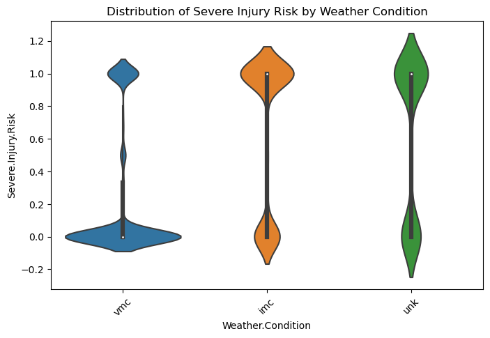

# Aviation Accident Analysis

## Analysis Summary

### Project Overview
This project analyzed aviation accident data (1948–2023) to evaluate aircraft safety, focusing on injury severity and aircraft destruction rates across different manufacturers and aircraft types.

### Data Preparation
After cleaning and filtering the dataset (using data from 1983 onwards and ensuring at least 10 observations per make/model), aircraft were grouped into two categories: small and large, based on a 20-passenger threshold. This ensured fair and meaningful comparisons between general aviation and commercial aircraft.

### Injury Rate Analysis
The analysis of severe/fatal injury rates showed clear differences between the two aircraft groups. Small aircraft displayed higher variability in injury outcomes across manufacturers, indicating that safety performance is more influenced by factors such as design, usage, and operational context. In contrast, large aircraft showed lower and more consistent injury rates, reflecting stronger standardization and stricter safety regulations in commercial aviation.

### Aircraft Destruction Rates
A similar trend was observed in destruction rates. Large aircraft generally showed lower or near-zero destruction rates and more consistent performance across manufacturers. Small aircraft, however, exhibited wider variation in survivability outcomes, depending on the manufacturer.

### Safest Aircraft Manufacturers (Key Findings)

#### Small Aircraft (Safer Makes Based on Injury and Destruction Rates)
- Grumman ACFT Eng Cor-Schweizer  
- Aviat Aircraft Inc  
- De Havilland  
- Diamond Aircraft Ind Inc  
- Flight Design GmbH  
- Robinson Helicopter  
- Waco  
- Maule  
- Boeing Stearman  
- American Champion Aircraft  

#### Large Aircraft (Safer Makes Based on Injury and Destruction Rates)
- Aero Commander  
- Gulfstream  
- Sikorsky  
- De Havilland  
- Swearingen  
- Canadair  
- McDonnell Douglas  
- Boeing  
- Airbus Industrie  
- Embraer  

### Overall Insight
Overall, the findings indicate that large commercial aircraft tend to provide more stable and predictable safety performance, while small aircraft show greater variability in risk depending on design and manufacturer. Aircraft type plays a key role in both survivability and injury outcomes in aviation accidents.

### Analysis of Other Factors Affecting Aircraft Safety

In addition to aircraft type and manufacturer, the analysis also explored how external operational factors influence aircraft damage and injury severity. Two key variables were examined: **phase of flight** and **weather conditions**.

### Phase of Flight and Injury Risk
While specific datasets can vary, general aviation safety trends often highlight the following:

* High-Risk Phases: Phases like approach, landing, and takeoff are considered "critical phases of flight" due to their complexity. Approach and landing alone can account for over 50% of all accidents.
* Fatality Risk vs. Frequency: Interestingly, while landing accounts for many accidents, it often has lower fatality rates compared to phases like maneuvering or cruise, which can have much higher odds of fatality if an accident occurs.
* Safety in Altitude: The cruise phase, which covers most of the flight time, is typically the safest. [4, 5, 6, 7, 8, 9, 10]

### Weather Conditions and Injury Risk
* Risk Extremes: In all three categories, the risk values are heavily concentrated at the extreme ends ($0.0$ and $1.0$), suggesting that injury outcomes in these events tend to be either very low or very high, rather than moderate.
* Safety Comparison: The vmc category shows the safest profile, as its distribution is most heavily weighted toward the $0.0$ risk mark compared to the other two categories.
* Predictive Uncertainty: Both imc and unk show a higher relative frequency of high-risk outcomes (near $1.0$) than vmc.
  ### Severe Injury Risk by Weather Condition

